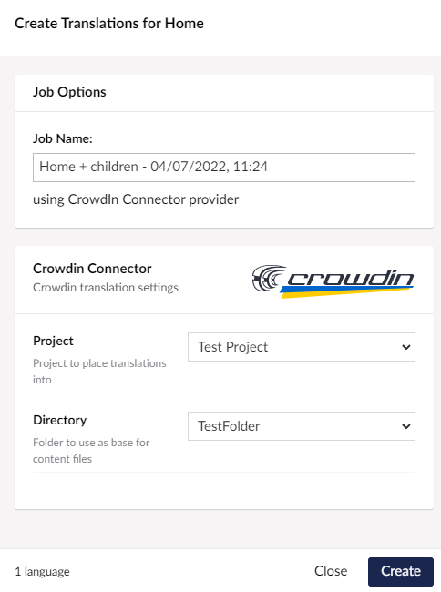

Once your CrowdIn connector is setup you can use it to send content for translation via the CrowdIn service.

## Send to translation
### 1. Send content for translation
 Follow the steps in the [Send for translation section](LINK) of this documentation.

### 2. Choose options
When you get to the connector section you can choose the crowdIn connector 

:::note
Depending on the connector settings you will either see the option to choose the project and directory on crowdin to store the translations or the values will be locked.
:::

### 3. Create Job

Click on the Create Job button and the translation job will be created for you.

### 4. View job 
Once you have created a job you can view the progress inside Umbraco

As the job progresses Umbraco will periodically check to see if the job has reached 100% approved. 

when a file is 100% approved it can be downloaded back into Umbraco. either via the background processes or by clicking on the 'Check' button at the bottom of the job page. 

### 5. Approve the job

Following the steps in the [Approve Translations](LINK) part of the documentation you can put your translations back into Umbraco. 

## Notes 

- When you create a job in Translation Manager a single file for each language will be created in CrowdIn, within the selected project and directory. 

- Translation Manager creates a file per language inside crowdin (not a single file for multiple languages)

- If you cancel a job in Translation manager this will remove the file from Crowdin, you may still incur charges for any translations that have already happened for the file, but these will be lost if you delete the file. 

- You cannot reset a canceled job as the files will have been deleted from crowdin. 

- re-submiting the same content will trigger the Translation memory inside CrowdIn to retranslate the content.

